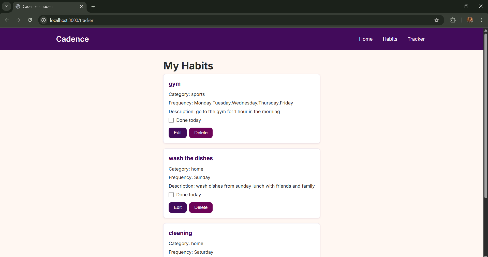

# Web Application Document - Projeto Individual - Módulo 2 - Inteli

## Cadence - Achieve your Goals

#### Lavínia Pietra Carvalho Mendonça

## Sumário

1. [Introdução](#c1)  
2. [Visão Geral da Aplicação Web](#c2)  
3. [Projeto Técnico da Aplicação Web](#c3)  
4. [Desenvolvimento da Aplicação Web](#c4)  
5. [Referências](#c5)  

 

## 1. Introdução

O projeto Cadence consiste em um gerenciador de hábitos minimalista, desenvolvido com o objetivo de auxiliar usuários na criação, monitoramento e manutenção de hábitos ao longo do tempo. A aplicação busca promover a construção de rotinas consistentes, alinhadas às metas pessoais de cada indivíduo, contribuindo para o desenvolvimento de uma vida mais organizada e produtiva. A arquitetura do sistema segue o padrão MVC (Model-View-Controller), garantindo uma separação clara de responsabilidades e maior facilidade de manutenção. O armazenamento dos dados é feito utilizando o banco de dados relacional PostgreSQL, oferecendo escalabilidade à aplicação.

---

## 2. Visão Geral da Aplicação Web

### 2.1. Personas (Semana 01 - opcional)

*Posicione aqui sua(s) Persona(s) em forma de texto markdown com imagens, ou como imagem de template preenchido. Atualize esta seção ao longo do módulo se necessário.*

### 2.2. User Stories (Semana 01 - opcional)

*Posicione aqui a lista de User Stories levantadas para o projeto. Siga o template de User Stories e utilize a referência USXX para numeração (US01, US02, US03, ...). Indique todas as User Stories mapeadas, mesmo aquelas que não forem implementadas ao longo do projeto. Não se esqueça de explicar o INVEST de 1 User Storie prioritária.*

---

## 3. Projeto da Aplicação Web

### 3.1. Modelagem do banco de dados 

A modelagem do banco de dados do sistema Cadence foi estruturada com três entidades principais: Category, Habit e HabitTracker. O objetivo do sistema é permitir a criação, categorização e acompanhamento de hábitos pessoais com frequências personalizadas, de maneira simples e eficiente.

Imagem 1 -  Modelagem do banco de Dados

É possível conferir o arquivo de modelagem física do banco de dados do Cadence clicando <a href="../scripts/init.sql"> aqui. </a>

### 3.1.1 BD e Models
Os Models implementados no sistema do projeto Cadence são responsáveis pela comunicação direta com o banco de dados PostgreSQL, facilitando as operações de manipulação de dados por meio do CRUD (create, read, update, delete). Essa arquitetura promove a organização do código e abstrai a complexidade das consultas SQL, tornando o desenvolvimento da aplicação modular e eficiente.

A camada de model é composta por:

- **CategoryModel**: manipula os dados relacionados às categorias de hábitos. Inclui métodos para criar, buscar e deletar categorias no banco de dados.

- **HabitModel:** manipula os dados referentes aos hábitos cadastrados pelos usuários. Inclui métodos para criar, listar, editar e deletar hábitos.

- **config/db.js**: arquivo para a conexão com o banco de dados que utiliza a biblioteca pg (um driver para PostgreSQL no ambiente Node.js que configura a pool, gerencia os parâmetros de conexão e fornece interface para a execução de consultas SQL pelos models) para integração com o PostgreSQL.

O banco de dados relacional possui três tabelas principais: _category_, que armazena os tipos de categorias dos hábitos, _habit_, que contém os hábitos registrados, ligados a uma categoria e, por fim, _habit_tracker_, que relaciona os hábitos à marcação diária de execução, sendo responsável por registrar a recorrência de cada hábito.

Essa estrutura proporciona um ambiente robusto e escalável para o desenvolvimento do sistema de gestão de hábitos, facilitando a manutenção e futuras expansões.

### 3.2. Arquitetura

A aplicação web segue o padrão de arquitetura MVC (Model-View-Controller), conforme o diagrama abaixo:

Imagem 2 -  Diagrama de Arquitetura MVC

A arquitetura é organizada nas seguintes camadas:

- **Client**: camada de requisições HTTP, atualmente representada por ferramentas como Postman (em substituição temporária à interface de usuário). Envia comandos ao servidor por meio das rotas.

- **Routes**: define os endpoints da aplicação (routes/index.js) e direciona as requisições para os controladores apropriados.

- **Controllers:** contém a lógica responsável por processar as requisições, validar dados e interagir com os models. Exemplo:

- ***HabitController.js***: cria, lista, edita e deleta hábitos.

- ***CategoryController.js:*** cria categorias de hábitos.

- **Models**: camada de dados, responsável por executar comandos SQL. Conecta-se ao banco PostgreSQL e realiza as operações com as tabelas habit, category e habit_tracker.

- **Views**: neste momento, representadas pelas respostas JSON da API (ex: res.json(...)). A interface visual (front-end) será implementada nas próximas etapas.

- **Database**: banco PostgreSQL com as tabelas mencionadas, hospedado separadamente (Database Server).

O fluxo de dados segue o caminho
**Client → Routes → Controllers → Models → Database → Controllers → Views → Client** que permite uma separação clara de responsabilidades e facilitando a escalabilidade e manutenção da aplicação.

### 3.3. Wireframes (Semana 03 - opcional)

*Posicione aqui as imagens do wireframe construído para sua solução e, opcionalmente, o link para acesso (mantenha o link sempre público para visualização).*

### 3.4. Guia de estilos (Semana 05 - opcional)

*Descreva aqui orientações gerais para o leitor sobre como utilizar os componentes do guia de estilos de sua solução.*

### 3.5. Protótipo de alta fidelidade (Semana 05 - opcional)

*Posicione aqui algumas imagens demonstrativas de seu protótipo de alta fidelidade e o link para acesso ao protótipo completo (mantenha o link sempre público para visualização).*

### 3.6. WebAPI e endpoints (Semana 05)

*Utilize um link para outra página de documentação contendo a descrição completa de cada endpoint. Ou descreva aqui cada endpoint criado para seu sistema.*  

### 3.7 Interface e Navegação (Semana 07)

O desenvolvimento da interface web do sistema Cadence é voltado para o acompanhamento e gestão de hábitos, conforme a proposta inicial. A interface foi implementada utilizando EJS, que permite a renderização dinâmica de páginas diretamente no servidor por meio do framework Express. Três páginas principais foram estruturadas nesta etapa:

A primeira é a página inicial (home.ejs), que apresenta brevemente o sistema ao usuário e fornece os botões de navegação para outras seções, habits.ejs e tracker.ejs, ambas descritas a seguir.

Imagem 3 -  Tela Home

A segunda é a página de hábitos (habits.ejs), que representa o núcleo da aplicação. Nela, o usuário pode criar novos hábitos e categorias. Cada hábito pode ser configurado com um nome, descrição e dias da semana em que deve ser realizado. O botão "Add Habit" abre um pop-up com um formulário que permite preencher essas informações. Além disso, o botão "Add Category" abre outro pop-up que permite a criação de categorias personalizadas. As categorias criadas são listadas dinamicamente por meio de requisições ao backend.

Imagem 4 -  Tela Habits

Imagem 5 -  Create Category (Habits)

Imagem 6 -  Create Habit (Habits)

A terceira página, tracker.ejs, é estruturada para exibir visualmente o progresso do usuário, com marcadores de conclusão por dia. A página mostra os hábitos e suas informações.

Imagem 7 -  Create Category (Habits)

A navegação entre as páginas é feita por meio de um menu fixo no topo da aplicação, garantindo fácil acesso a qualquer parte do sistema. Toda a comunicação entre frontend e backend é feita por meio de requisições fetch API no arquivo script.js, que acessa rotas da API hospedadas no backend Express. As rotas utilizadas incluem *GET /api/category* (para listar as categorias disponíveis), *POST /api/category* (para criar uma nova categoria), *GET /api/habit* (para listar os hábitos cadastrados) e *POST /api/habit* (para criar um novo hábito).

Essas requisições são tratadas por controllers que se comunicam com o banco de dados Supabase para armazenar e recuperar as informações do usuário.

Nesta etapa, o foco foi garantir que as funcionalidades básicas da interface estivessem operacionais, incluindo a criação e listagem de hábitos e categorias, além de uma experiência de navegação fluida entre as páginas. A estrutura visual, embora simples, já permite interações fundamentais e serve de base para as melhorias visuais e funcionais dos próximos passos. Os próximos passos da aplicação contam com, por exemplo, a adoção de mais requisições realizadas por meio do front-end, como a edição de hábitos já existentes e exclusão de categorias não mais utilizadas. 

---

## 4. Desenvolvimento da Aplicação Web (Semana 8)

### 4.1 Demonstração do Sistema Web (Semana 8)

*VIDEO: Insira o link do vídeo demonstrativo nesta seção*
*Descreva e ilustre aqui o desenvolvimento do sistema web completo, explicando brevemente o que foi entregue em termos de código e sistema. Utilize prints de tela para ilustrar.*

### 4.2 Conclusões e Trabalhos Futuros (Semana 8)

*Indique pontos fortes e pontos a melhorar de maneira geral.*
*Relacione também quaisquer outras ideias que você tenha para melhorias futuras.*

## 5. Referências

_Incluir as principais referências de seu projeto, para que o leitor possa consultar caso ele se interessar em aprofundar._ 

---
---